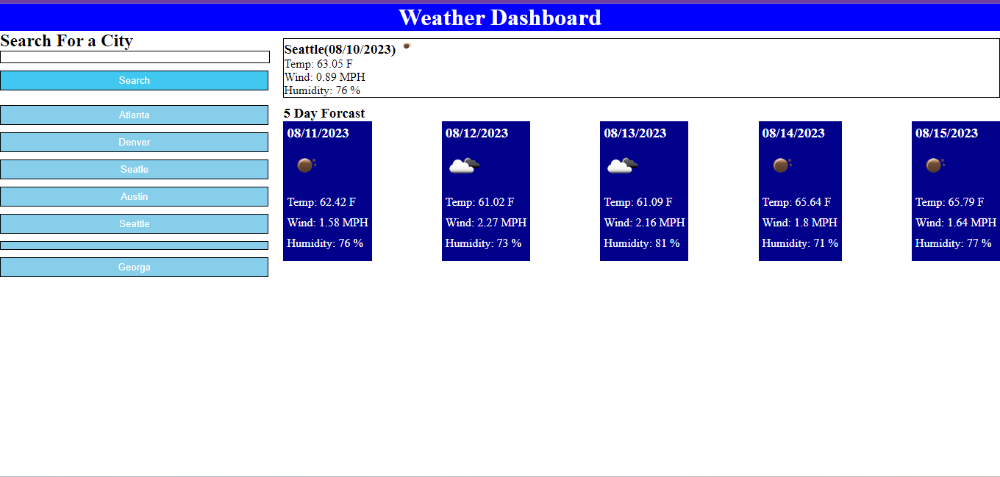

# Weather-Dashboard

## User Story

AS A traveler
I WANT to see the weather outlook for multiple cities
SO THAT I can plan a trip accordingly

## Acceptance Criteria:

GIVEN I am taking a code quiz
WHEN I click the start button
THEN a timer starts and I am presented with a question
WHEN I answer a question
THEN I am presented with another question
WHEN I answer a question incorrectly
THEN time is subtracted from the clock
WHEN all questions are answered or the timer reaches 0
THEN the game is over
WHEN the game is over
THEN I can save my initials and my score

## Motivation

I created this website to further my education with JavaScript, CSS, and HTML, local storage, and API functionality.

## Why

I wanted to create a website that would allow users to search city names and get the current weather and 5 day forecast. I also wanted to create a website that would allow users to save their searches and access them later.

## What Problem Does it Solve?

This weather dashboard solves the problem of having to search multiple websites to get the current weather and 5 day forecast for a city. It also solves the problem of having to remember the names of cities that you have searched in the past.

## What Did I Learn?

I learned how to use JavaScript, API, CSS, and HTML to create a website incorporating a weather that allows users to search city names and get the current weather and 5 day forecast. I also learned how to use local storage to save user searches.

## Usage

To use this website, simply type in the name of the city you would like to search in the search bar and click the search button. The current weather and 5 day forecast will be displayed. To save your search, click the save button. To access your saved searches, click the saved searches button.

## preview of website

#### Link to githubrepo: 
<https://github.com/precisecoding/Weather-Dashboard.git>

#### Deployed link: 
<https://precisecoding.github.io/Weather-Dashboard/>

#### This site was built using github pages.
<https://pages.github.com/>

##### License
MIT License
<https://opensource.org/licenses/MIT>
<https://choosealicense.com/licenses/mit/>
LICENSE file included in repository.

##### Thanks to everyone for support and contributions!
Sources used:
<https://developer.mozilla.org/en-US/>, <https://www.w3schools.com/>, <https://stackoverflow.com/>. Worked with tutor, Cody Junier from DU Whow was helpful.
